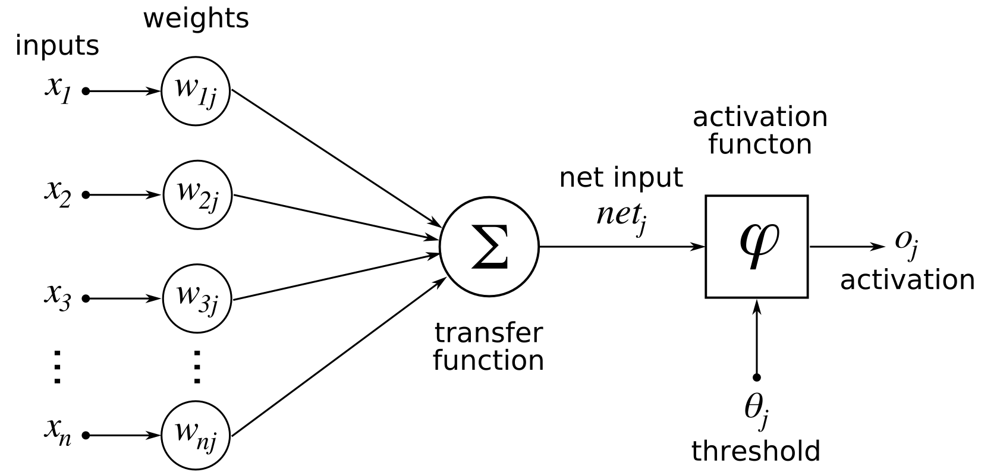

# Neural-network-from-scratch
 Creation of a neural network for image classification purposes (probably fashion mnist) without machine learning library

### REF : USEFULL WEBSITE (help, inspiration) FOR THIS PROJECT
C++ neural network from scratch explained : 
https://causeyourestuck.io/2017/06/12/neural-network-scratch-theory/
Object-Oriented approach to Neural Networks 
http://citeseerx.ist.psu.edu/viewdoc/download?doi=10.1.1.46.8774&rep=rep1&type=pdf
## 1 - LOAD MNIST HANDWRITTEN DIGIT IN C++  
MNIST handwritten digit is a known dataset for learning machine learning, this popularity will allow me to have support to realize my neural network, and then test it on fashion mnist which is very similar
#### 1.1 - Download MINST handwritten digit dataset
The files are available here : http://yann.lecun.com/exdb/mnist/
#### 1.2 - Load data 
It's pretty easy to open and read and use a byte file in python, but i choose C++ in this project so i choose to use code from 
https://github.com/wichtounet/mnist which allow me to easily read the byte file of MNIST
##### Usage (for configuration check his github): 
 ``` 
 #include <iostream>
 #include "mnist/mnist_reader.hpp"
 
 int main() {
     // MNIST_DATA_LOCATION set by MNIST cmake config
     std::cout << "MNIST data directory: " << MNIST_DATA_LOCATION << std::endl;
 
     // Load MNIST data
     mnist::MNIST_dataset<std::vector, std::vector<uint8_t>, uint8_t> dataset =
             mnist::read_dataset<std::vector, std::vector, uint8_t, uint8_t>(MNIST_DATA_LOCATION);
 
     std::cout << "Nbr of training images = " << dataset.training_images.size() << std::endl;
     std::cout << "Nbr of training labels = " << dataset.training_labels.size() << std::endl;
     std::cout << "Nbr of test images = " << dataset.test_images.size() << std::endl;
     std::cout << "Nbr of test labels = " << dataset.test_labels.size() << std::endl;
     std::cout << dataset.test_images.at(0).size() << std::endl;
     //It's a vector of size of 28*28 (784) because mnist image have 28x28 px
     for (int a : dataset.test_images.at(0)) {
         std::cout << a << std::endl;
     }
     return 0;
 }
  ``` 
## 2 - Conception
This part may change in the future, if i misunderstanding a concept, 
or that my design is not adapted to the problem in the "
Encountered problem" section, if you decide to create your own neural network, I will try to note all the problem that I have to meet and the solutions that I chose. 
#### 2.1 - What is a neuron ?
> An artificial neuron is a mathematical function conceived as a model of biological neurons, a neural network. Artificial neurons are elementary units in an artificial neural network. The artificial neuron receives one or more inputs (representing excitatory postsynaptic potentials and inhibitory postsynaptic potentials at neural dendrites) and sums them to produce an output (or activation, representing a neuron's action potential which is transmitted along its axon). Usually each input is separately weighted, and the sum is passed through a non-linear function known as an activation function or transfer function. [...] 

Source : https://en.wikipedia.org/wiki/Artificial_neuron

This, is the wikipedia definition but i don't find wikipedia always accessible, i will try with my words and my vision to explain how it work



So, this is the scheme of an Artificial Neuron, 
#### 2.2 - What is a neural network ?

## Encountered problem
## License
The files are distributed under the terms of the MIT License. The MNIST
files are not my property. If used in a paper, you'll need to cite the reference
paper, as indicated in the [official website]

[official website]: <http://yann.lecun.com/exdb/mnist/>